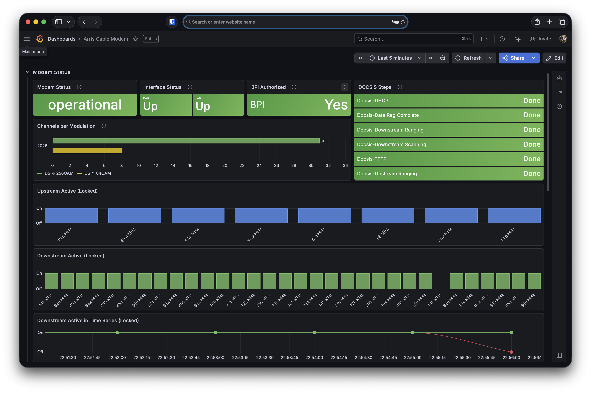
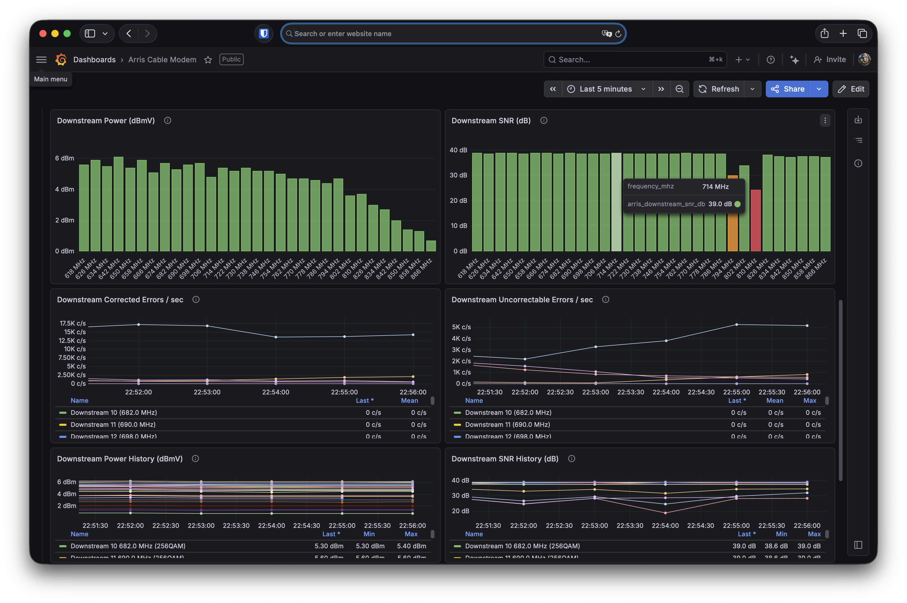

# Arris Touchstone Cable Modem Prometheus Exporter

Prometheus exporter that scrapes the web interface of Arris Touchstone DOCSIS cable modems and exposes RF signal metrics, registration status, and interface stats.

Tested with Arris/ARRIS Touchstone modems (status page at `http://192.168.100.1/cgi-bin/status_cgi`).

## Metrics

### Downstream (per channel)

| Metric | Description |
|---|---|
| `arris_downstream_power_dbmv` | Power level (dBmV) |
| `arris_downstream_snr_db` | Signal-to-noise ratio (dB) |
| `arris_downstream_frequency_hz` | Channel frequency (Hz) |
| `arris_downstream_octets_total` | Received octets |
| `arris_downstream_correcteds_total` | FEC corrected codewords |
| `arris_downstream_uncorrectables_total` | FEC uncorrectable codewords |

### Upstream (per channel)

| Metric | Description |
|---|---|
| `arris_upstream_power_dbmv` | Power level (dBmV) |
| `arris_upstream_frequency_hz` | Channel frequency (Hz) |
| `arris_upstream_symbol_rate_ksps` | Symbol rate (kSym/s) |

### Modem Status

| Metric | Description |
|---|---|
| `arris_uptime_seconds` | Modem uptime in seconds |
| `arris_cm_status` | CM operational status (operational / offline / other) |
| `arris_interface_up` | Interface state (1 = Up, 0 = Down) |
| `arris_interface_speed_mbps` | Interface speed (Mbps) |

### DOCSIS Registration (CM State)

| Metric | Description |
|---|---|
| `arris_docsis_step_completed` | Registration step completed (1/0), labeled by step name |
| `arris_tod_retrieved` | Time of Day retrieved (1/0) |
| `arris_bpi_authorized` | BPI authorized (1/0) |
| `arris_dhcp_attempts_ipv4` | DHCP IPv4 attempt count |
| `arris_dhcp_attempts_ipv6` | DHCP IPv6 attempt count |

### Scrape Health

| Metric | Description |
|---|---|
| `arris_scrape_success` | Last scrape succeeded (1/0) |
| `arris_scrape_duration_seconds` | Last scrape duration |

## Quick Start

```bash
python3.14 -m venv venv
source venv/bin/activate
pip install -r requirements.txt
python arris_exporter.py
```

Requires Python 3.10+.

The exporter listens on port `9120` by default. Metrics are available at `http://localhost:9120/metrics`.

### Options

```
--port PORT        Exporter listen port (default: 9120)
--interval SECS    Scrape interval in seconds (default: 30)
--base-url URL     Modem CGI base URL (default: http://192.168.100.1/cgi-bin)
```

## Docker

```bash
docker build -t arris-exporter .
docker run -d --name arris-exporter --net=host arris-exporter
```

Or with custom options:

```bash
docker run -d --name arris-exporter --net=host arris-exporter \
  --port 9120 --interval 60
```

## Prometheus Config

```yaml
scrape_configs:
  - job_name: arris_modem
    static_configs:
      - targets: ["localhost:9120"]
    scrape_interval: 60s
```

## Grafana Alloy Config

```alloy
prometheus.scrape "arris_modem" {
  targets = [{
    __address__ = "arris-exporter:9120",
  }]
  scrape_interval = "60s"
  forward_to     = [prometheus.remote_write.default.receiver]
}
```

## Grafana Dashboard

A ready-to-import dashboard is included in [`grafana/dashboard.json`](grafana/dashboard.json).

To import: Grafana → Dashboards → Import → Upload JSON file → select the Prometheus datasource.





## Useful Alerts

```yaml
groups:
  - name: cable_modem
    rules:
      - alert: ModemHighUncorrectables
        expr: rate(arris_downstream_uncorrectables_total[5m]) > 0
        for: 5m
        annotations:
          summary: "Uncorrectable FEC errors on {{ $labels.channel }}"

      - alert: ModemLowSNR
        expr: arris_downstream_snr_db < 33
        for: 5m
        annotations:
          summary: "Low SNR ({{ $value }} dB) on {{ $labels.channel }}"

      - alert: ModemOffline
        expr: arris_cm_status{arris_cm_status="operational"} == 0
        for: 1m
        annotations:
          summary: "Cable modem is not operational"

      - alert: ModemRegistrationFailed
        expr: arris_docsis_step_completed == 0
        for: 5m
        annotations:
          summary: "DOCSIS registration step failed: {{ $labels.step }}"
```
